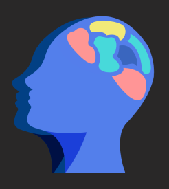

# juanvelazquez-portafolio
# 👋 Hola, soy Juan Manuel Velázquez Ogazón

🎓 Técnico en Programación | 💻 Futuro universitario en desarrollo de software  
Apasionado por la tecnología, el diseño digital y la salud mental. Me gusta crear soluciones útiles y accesibles para las personas.

---

## 🚀 Proyectos destacados

### 🧠 Emotion Control – App de salud mental
Aplicación desarrollada con App Inventor para brindar apoyo emocional a jóvenes.  
Incluye secciones para identificar emociones, frases motivacionales y recursos de ayuda.  
**Tecnologías:** App Inventor, lógica de programación, diseño UX  
📷 

---

### 🎨 Logo oficial – Emotion Control
Diseño de logo profesional con cerebro y corazón, representando la unión entre razón y emoción.  
**Colores:** Azul (confianza, tranquilidad), fondo negro  
📷 

---

## ⚒️ Habilidades técnicas
- Programación con App Inventor
- Diseño digital (presentaciones)
- Redacción clara de contenido técnico
- Resolución de problemas matemáticos

---

## 📫 ¿Hablamos?
Estoy disponible para colaborar en proyectos, tareas escolares o desarrollo de apps sencillas.  
📍 Desde México | ✉️ juanvelazquezogazon@gmail.com  
🔗 [Conecta conmigo en LinkedIn](https://www.linkedin.com/in/juan-manuel-velázquez-ogazón-5ba293372/)

---

_Gracias por visitar mi portafolio. ¡Seguimos construyendo! 🚀_
